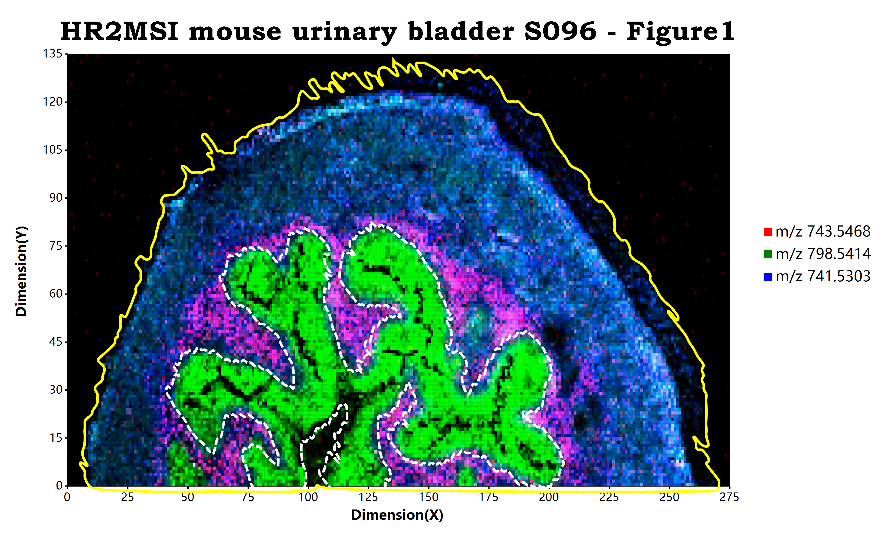

# MSImaging

> MS-imaging rendering package for R# environment based on the mzkit library and ggplot api

Mass spectrometry imaging ( MSI) is a technique used in mass spectrometry to visualize the spatial distribution of molecules, as biomarkers, metabolites, peptides or proteins by their molecular masses. After collecting a mass spectrum at one spot, the sample is moved to reach another region, and so on, until the entire sample is scanned.

## demo for single ion MSImaging

```r
require(MSImaging);
require(mzkit);
require(ggplot);

options(memory.load = "max");

bitmap(file = `${@dir}/HR2MSI_mouse_urinary_bladder_S096.png`, size = [4000, 2500]) {
    
    # load mzpack/imzML raw data file
    # and config ggplot data source driver 
    # as MSImaging data reader
    ggplot(open.mzpack(system.file("data/HR2MSI mouse urinary bladder S096 - Figure1.cdf", package = "MSImaging")), 
           mapping = aes(driver = MSImaging()), 
           padding = "padding: 200px 600px 200px 250px;"
    ) 
       # rendering of a single ion m/z
       # default color palette is Jet color set
       + geom_msimaging(mz = 741.5, tolerance = "da:0.3")
       # add ggplot charting elements
       + ggtitle("MSImaging of m/z 741.5")
       + labs(x = "Dimension(X)", y = "Dimension(Y)")
       + scale_x_continuous(labels = "F0")
       + scale_y_continuous(labels = "F0")
    ;
}
```


## demo for RGB channels ions composition

```r
require(MSImaging);
require(mzkit);
require(ggplot);

options(memory.load = "max");

bitmap(file = `${@dir}/HR2MSI_mouse_urinary_bladder_S096_RGB.png`, size = [3300, 2000]) {
    
    # load mzpack/imzML raw data file
    # and config ggplot data source driver 
    # as MSImaging data reader
    ggplot(open.mzpack(system.file("data/HR2MSI mouse urinary bladder S096 - Figure1.cdf", package = "MSImaging")), 
           mapping = aes(driver = MSImaging()), 
           padding = "padding: 200px 600px 200px 250px;"
    ) 
       # rendering of a single ion m/z
       # default color palette is Jet color set
       + geom_red(mz = 743.5468, tolerance = "da:0.3")
       + geom_green(mz = 798.5414, tolerance = "da:0.3")
       + geom_blue(mz = 741.5303, tolerance = "da:0.3")
       # add ggplot charting elements
       + ggtitle("HR2MSI mouse urinary bladder S096 - Figure1")
       + labs(x = "Dimension(X)", y = "Dimension(Y)")
       + scale_x_continuous(labels = "F0")
       + scale_y_continuous(labels = "F0")
    ;
}
```

